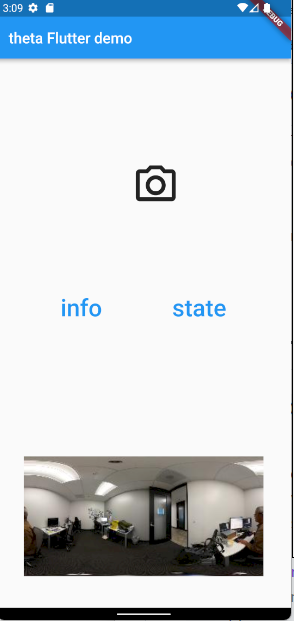
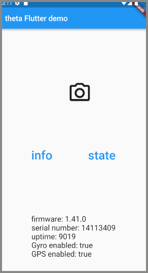
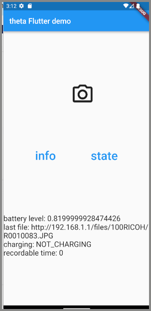

# theta_tutorial

[Flutter tutorial for theta-client on YouTube](https://youtu.be/EAwT2j0x5VU?feature=shared)

Build new Flutter app from blank editor and use
theta-client to handle camera connection.



## Info example

```
var thetaInfo = await _thetaClientFlutter.getThetaInfo();
...
...
Text(
    'firmware: ${thetaInfo.firmwareVersion}\n'
    'serial number: ${thetaInfo.serialNumber}\n'
    'uptime: ${thetaInfo.uptime}\n'
    'Gyro enabled: ${thetaInfo.hasGyro}\n'
    'GPS enabled: ${thetaInfo.hasGps}',
    style: const TextStyle(fontSize: 20),
    ),
```



